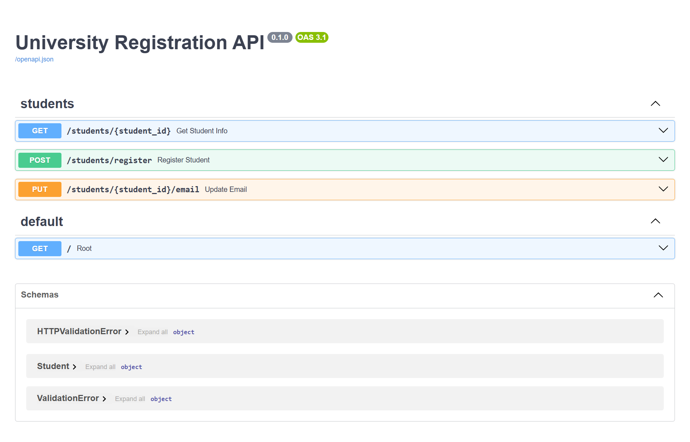

# University Registration API

A FastAPI-based API for managing university student registration with input validation and error handling.

## Features

- Student registration with validation
- Get student information with optional grades
- Update student email
- Request logging middleware
- In-memory database storage
- Input validation using Pydantic models

## API Endpoints

### 1. Register Student
**POST** `/students/register`

#### Register a new student with validation for:
- Name (alphabets and spaces only, max 50 chars)
- Email (valid email format)
- Age (between 18-30)
- Courses (1-5 courses, no duplicates)

##### Example request:
```json
{
    "name": "John Doe",
    "email": "john.doe@example.com",
    "age": 20,
    "courses": ["Mathematics", "Physics", "Chemistry"]
}
```

### 2. Get Student Information
**GET** `/students/{student_id}`


#### Retrieve student information with optional parameters:

- student_id: Integer between 1001-9999
- include_grades: Boolean (true/false)
- semester: Optional (Format: Fall2024, Spring2025, Summer2024)
- Example request:
##### Example request:
```js
GET /students/1001?include_grades=true&semester=Fall2024
```

### 3. Update Student Email
**PUT** /students/{student_id}/email

#### Update a student's email address:

- student_id: Integer between 1001-9999
- Valid email format required
##### Example request:
```json
{
    "email": "new.email@example.com"
}
```

## API Documentation Screenshots



## Installation
1. Clone the repository:

```bash
git clone [repository-url]
```
2. Install dependencies:
```bash
poetry install
```
3. Run the application:
```bash
uvicorn main:app --reload
```

- The API will be available at 
```bash
http://localhost:8000
```
- API Documentation
Swagger UI: 
```bash
 http://localhost:8000/docs
```

## Project Structure

```bash
├── app/
│   ├── api/
│   │   └── students.py
│   ├── db/
│   │   └── database.py
│   ├── middleware/
│   │   └── logging.py
│   └── models/
│       └── student.py
├── main.py
├── pyproject.toml
└── README.md

```

## Testing
Use the provided Postman collection 
```bash
University Registration API.postman_collection.json 
```
to test the endpoints.

## Error Handling
The API includes comprehensive error handling for:

- Invalid student ID range
- Invalid email format
- Invalid name format
- Age restrictions
- Course count limitations
- Duplicate course entries
- Invalid semester format
## Logging
Request logging middleware captures:

- Request path
- HTTP method
- Processing time

